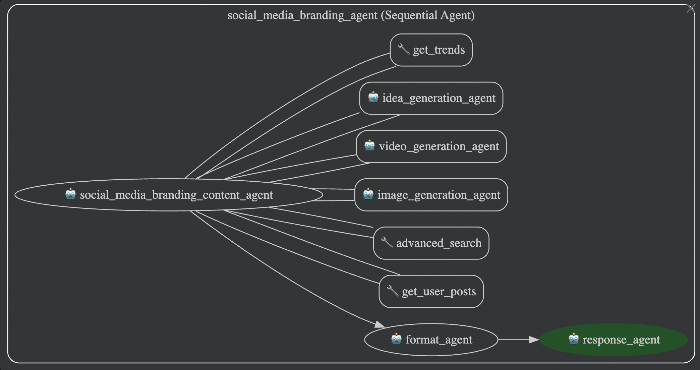

# Social Media Branding Agent

   

## Inspiration

In today's hyper-connected world, personal and business branding on social media is no longer optional—it's essential. Yet, many individuals and small businesses struggle to create consistent, engaging, and platform-specific content that resonates with their audience. Our inspiration came from the observation that content creation remains time-consuming, fragmented, and often intimidating for those without design or marketing experience. We envisioned a system where anyone could build a compelling digital presence—automatically and intelligently—with just one idea or social profile.

## What it does

**Social Media Branding Agent** is an AI-powered content generation platform that transforms a single prompt or social media account into engaging, customized posts across platforms like Instagram, Twitter/X, TikTok, and LinkedIn. It not only generates text but also curates and creates matching images and videos, complete with voice-over narration when needed.

Key features include:
- Multimodal content generation (text + image + video)
- Platform-specific formatting and tone adjustments
- Trend analysis to boost relevance and engagement
- One-click publishing or scheduling
- Option to analyze an existing social media account to derive voice and tone

## How we built it

   

We used **Google ADK (Agent Development Kit)** to build a multi-agent system capable of orchestrating content generation workflows. Each agent has a specialized function:
- **Trend Scout Agent** pulls real-time social trends using APIs and web scraping.
- **Persona Modeling Agent** analyzes user input or linked social profiles to determine tone, style, and topics of interest.
- **Content Creator Agent** uses large language models (like GPT-4-turbo) to generate high-quality captions and scripts.
- **Visual Agent** generates matching images and short videos using diffusion models and TTS (text-to-speech) systems.
- **Publishing Agent** formats and queues the post for cross-platform publication via social media APIs.

The backend is deployed on a scalable cloud environment (GCP), and the frontend is a React-based web interface.

## Challenges we ran into

- **Cross-platform formatting**: Every social media platform has different constraints and audiences, requiring fine-tuned content adjustment.
- **Video and voiceover generation latency**: Rendering videos with narration in real-time was resource-intensive and required optimization.
- **Persona extraction**: Inferring brand tone and personality from limited user data proved difficult and required iterative improvement.
- **API limitations**: Rate limits and inconsistent access to trending content data across platforms slowed real-time operations.

## Accomplishments that we're proud of

- Successfully created a seamless pipeline from prompt input to final post generation with multimodal support.
- Built a scalable agent architecture that can be easily extended or parallelized.
- Integrated real-time trend analysis for contextually relevant content generation.
- Enabled full automation for users with minimal technical knowledge.

## What we learned

- Multi-agent design improves modularity and fault isolation in complex workflows.
- Social media engagement is highly dependent on tone, trend relevance, and visual timing.
- Content generation that feels "authentic" requires more than templates—it requires an understanding of narrative and voice.
- Efficient video generation and narration is key to standing out on platforms like TikTok and Instagram Reels.

## What's next for Social Media Branding Agent

- **Mobile app integration** for creators on the go
- **A/B testing engine** to evaluate content performance automatically and adapt strategy
- **Multi-language support** to help users grow global audiences
- **Partnership APIs** so influencers and small brands can co-brand or share agent-powered content
- **Analytics dashboard** to track engagement, reach, and brand growth over time

We're excited to continue developing this agent as a tool that empowers every creator—whether you're a startup, a solo founder, or an aspiring influencer—to build a professional, engaging online presence effortlessly.